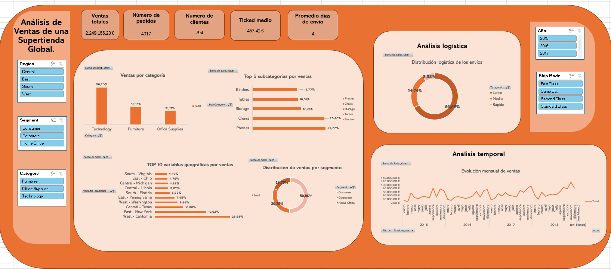

# 🔎 Análisis Comercial y Logístico de Ventas de una Supertienda Global
 
**📃Descripción del proyecto**


Este proyecto realiza un análisis comercial y logístico de las ventas de una supertienda global a partir de un conjunto de datos históricos de transacciones. El objetivo principal es explorar el comportamiento de las ventas desde diferentes perspectivas —comercial, geográfica, temporal y logística— para identificar patrones, tendencias y relaciones relevantes entre las variables del negocio.

El dataset contiene información relacionada con pedidos, clientes, productos, categorías, regiones comerciales y tipos de envío, permitiendo analizar cómo se distribuyen las ventas según distintos segmentos y ubicaciones geográficas. Cada registro representa una transacción asociada a un producto dentro de un pedido.

Durante el desarrollo del proyecto se llevaron a cabo procesos de limpieza y transformación de datos mediante Excel y Power Query, incluyendo el tratamiento de nulos, detección de duplicados, corrección de formatos y creación de variables derivadas orientadas a enriquecer el análisis.

Posteriormente, se realizó un análisis exploratorio de datos (EDA) con el objetivo de identificar comportamientos relevantes en las ventas, detectar valores atípicos y estudiar la relación entre variables categóricas y numéricas. Finalmente, se diseñó un dashboard interactivo que resume los principales indicadores comerciales y logísticos del negocio mediante visualizaciones dinámicas y filtros interactivos.


 
**🗼Estructura del proyecto**


```text
├── data/
│   ├── datos_crudos/
│   │   └── train.csv                 # Dataset original sin procesar
│   │
│   └── datos_procesados/
│       ├── superstrore_sales_dataset.csv                 # Dataset utilizado durante el análisis
│       └── superstrore_sales_dataset.xlsx      # Archivo Excel con limpieza, transformación,
│                                     # análisis exploratorio, KPIs y dashboard
│
├── images/
    ├──dashboard_superstore.png       # Captura dashboard
└── README.md                         # Documentación e informe explicativo del proyecto
```


**📁 Descripción de las carpetas**

* **datos_crudos/**: Contiene el conjunto de datos original proporcionado para el desarrollo del proyecto, sin modificaciones ni transformaciones.

* **datos_procesados/**: Incluye los archivos utilizados durante el proceso analítico, así como el documento Excel donde se realizaron todas las fases del proyecto:

  * limpieza y transformación de datos,
  * análisis exploratorio de datos (EDA),
  * detección de outliers,
  * creación de variables derivadas,
  * cálculo de KPIs,
  * elaboración del dashboard interactivo.

* **README.md**: Documento principal del proyecto, donde se describe el proceso seguido, los análisis realizados y las principales conclusiones obtenidas.

         
        
**👩‍💻Instalación y Requisitos**
 
Este proyecto usa la versión de Excel 2604 y requiere de las siguientes herramientas:
 
- Power Query
- Herramientas de análisis de datos
- Funciones
- Gráficas
 
**🤓Resultados y Conclusiones**

El análisis exploratorio realizado sobre las ventas de la supertienda global permitió identificar distintos patrones comerciales, geográficos y logísticos relevantes para comprender el comportamiento del negocio.

En primer lugar, se observó que la categoría **Technology** es la principal fuente de ingresos, concentrando aproximadamente el 36,7% de las ventas totales. Dentro de las subcategorías, destacan especialmente **Phones** y **Chairs**, que representan los productos con mayor volumen de ventas dentro del conjunto analizado.

Desde el punto de vista de los clientes, el segmento **Consumer** domina claramente las ventas, generando más del 50% de los ingresos totales. Esto refleja una fuerte dependencia del negocio respecto a los clientes particulares frente a otros segmentos como Corporate o Home Office.

A nivel geográfico, las regiones **West** y **East** presentan el mayor volumen de ventas, destacando especialmente estados como **California** y **New York**, que concentran una parte muy significativa de los ingresos del negocio. Por el contrario, otros estados muestran una participación considerablemente menor, evidenciando una distribución geográfica desigual de las ventas.

En relación con la logística, el tipo de envío **Standard Class** concentra la mayor parte de las transacciones, representando cerca del 60% de las ventas totales. Además, el análisis de la variable derivada relacionada con el tipo de envío mostró que la mayoría de los pedidos se clasifican como envíos lentos, mientras que los envíos rápidos representan una proporción mucho menor del total.

El análisis estadístico de la variable `Sales_clean` reveló una distribución altamente asimétrica y con presencia de valores atípicos significativos. La diferencia entre media y mediana, junto con elevados valores de curtosis y asimetría, confirmó la existencia de un gran número de ventas pequeñas y un reducido grupo de transacciones de importe muy elevado. Tras aplicar el método IQR para la detección de outliers, se decidió mantener estos registros al considerarse representativos del comportamiento real de las ventas en una supertienda global.

Finalmente, todos estos resultados fueron integrados en un dashboard interactivo diseñado para facilitar la visualización y exploración de los principales indicadores comerciales y logísticos del negocio mediante filtros dinámicos y gráficos interactivos.
 
Los resultados obtenidos permiten identificar las principales fuentes de ingresos de la supertienda global, así como los segmentos de clientes, regiones y categorías de producto con mayor impacto comercial. Esta información puede resultar útil para la toma de decisiones estratégicas relacionadas con la gestión de inventario, optimización logística, segmentación de clientes y planificación comercial. Además, el dashboard desarrollado facilita la monitorización visual de los principales indicadores del negocio, permitiendo explorar el comportamiento de las ventas de forma dinámica e interactiva dentro del contexto comercial de una supertienda global.


**📊 Dashboard**




 
**👉Próximos pasos**

Aunque el proyecto ha permitido obtener una visión general del comportamiento comercial y logístico de las ventas de la supertienda global, existen distintas líneas de mejora y expansión que podrían enriquecer futuros análisis:

* Incorporar nuevos datos históricos para realizar análisis temporales más completos y detectar tendencias de crecimiento o estacionalidad en las ventas.

* Desarrollar modelos predictivos orientados a estimar ventas futuras, comportamiento de clientes o demanda de productos a partir de datos históricos.

* Profundizar en el análisis geográfico mediante mapas interactivos que permitan visualizar de forma más precisa la distribución territorial de las ventas.

* Implementar el dashboard en herramientas especializadas de visualización como Power BI o Tableau para mejorar la interactividad y escalabilidad del análisis.

* Automatizar los procesos de limpieza y transformación de datos mediante herramientas ETL o lenguajes de programación como Python y SQL.

* Incorporar nuevas métricas de negocio relacionadas con rentabilidad, frecuencia de compra, fidelización de clientes o eficiencia logística.

* Analizar el impacto de factores externos, como campañas comerciales, periodos festivos o promociones, sobre el comportamiento de las ventas y los patrones de compra.


**✍️Contribuciones**
 
Las contribuciones son bienvenidas. Si deseas mejorar el proyecto, por favor abre un push request o una issue.
 
**🗯️Autores y Agradecimientos**
 
**Claudia Soler** - [@clausoler](https://github.com/clausoler/Proyecto_dashboard_analisis_datos)
